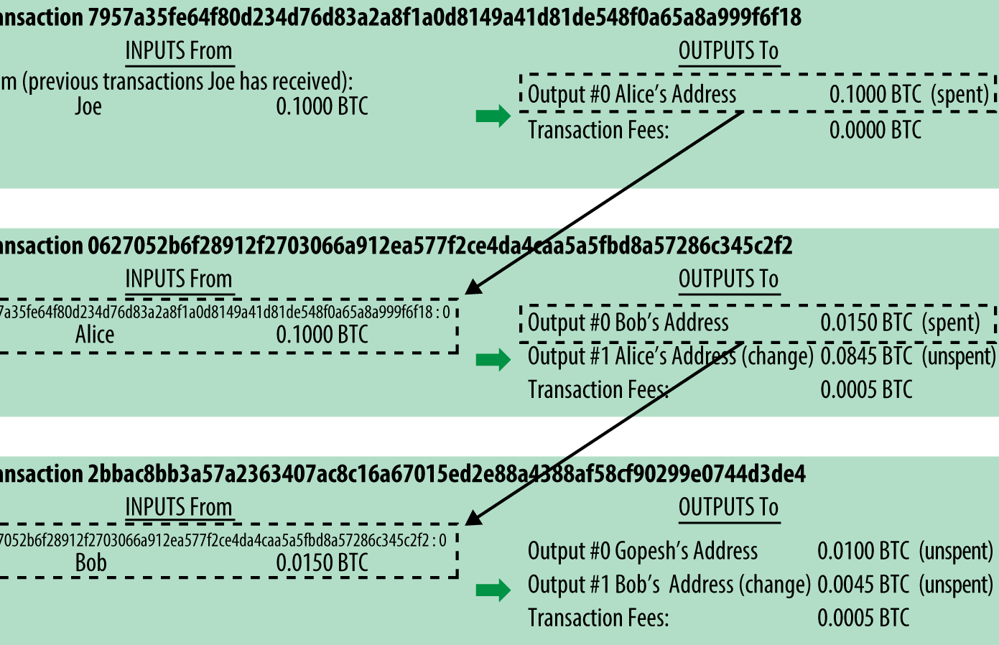
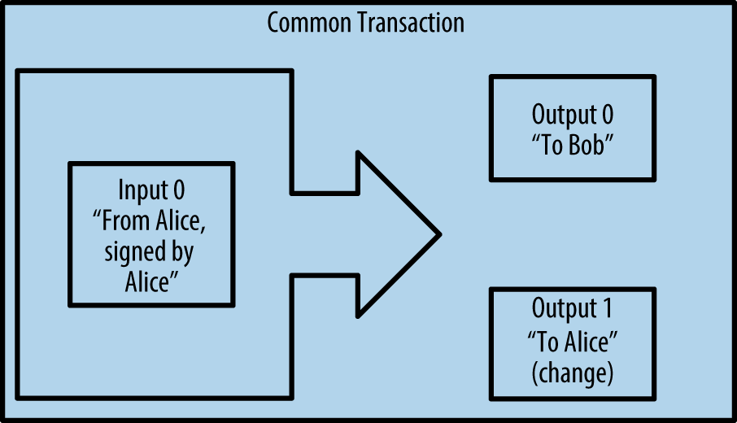
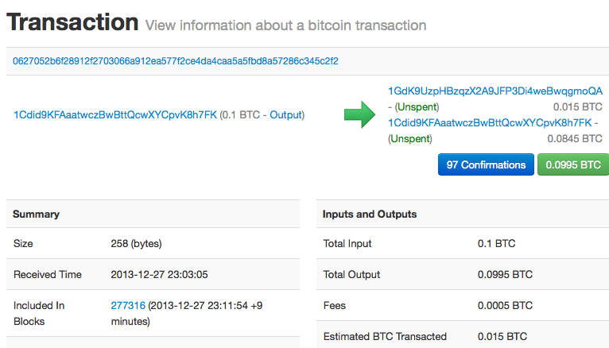

## 区块链入门

### BTC - 交易

**概念**

一笔交易告诉网络,一些比特币价值的所有者已经授权将该价值转移给另一个所有者,新的所有者现在可以通过创建另一个授权转让给另一个所有者的交易来支付比特币

每笔交易包含一个或多个`输入input`,在交易的另一端,有一个或多个`输出output`

每个输入都包含了一个签名脚本`scriptSig`,签名脚本中包含了所有者的数字签名和公钥,交易发起的时候,他们的钱包会使用签名中的私钥对交易数据进行签名,网络中的节点会使用签名脚本中的公钥验证,验证通过后的交易才会被打包到区块中

输出中通常包含一个锁定脚本,就是用接受者的公钥来锁定脚本,如果他们需要花费,则使用私钥进行签名即可




**常见的交易形式**

最常见的交易形式是从一个地址到另一个地址的简单支付,通常包括一些`找零`返回给原始所有者.这类交易有一个输入和两个输出



另一种是汇集多个输入到一个输出的交易,这类似现实世界中将一堆硬币和纸币换成单一较大面值的纸币的情况。此类交易有时候由钱包应用生成,以清理收到的大量小额零钱


最后,比特币账本中经常出现的另一种交易形式是将一个输入分配给代表多个收款人的多个输出交易,这类交易有时候被企业用来分配资金,例如在向多个雇员支付工资


**创建一笔交易**

钱包应用应该包含了选择合适的输入和输出的所有逻辑,根据Alice的具体设定创建对应的交易

Alice只需要制定目的地和金额,剩下的事情交给钱包应用.


**1. 获得正确的输入**

Alice的钱包应用首先必须找到可以支付她想要发送给Bob的金额的输入,大多数钱包跟踪属于钱包地址的所有可用输出.
因此Alice的钱包将包含Joe的交易输出的副本(就是Joe转给Alice的交易),这样,钱包就可以创建alice的交易输入了以及快速验证传入的交易具有正确的输入.

> 作为完整节点客户端运行的比特币钱包实际上应该包含区块链上每笔交易的未使用输出的副本才可以

还有种情况是如果钱包应用中未保存未花费的交易的输出的副本,它也可以使用不同提供商提供的API来查询比特币网络来检索该信息

```shell
# 查看Alice's bitcoin address unspent outputs for all
$ curl https://blockchain.info/unspent?active=1Cdid9KFAaatwczBwBttQcwXYCpvK8h7FK
```
```json
{

	"unspent_outputs":[

		{
			"tx_hash":"186f9f998a5...2836dd734d2804fe65fa35779",
			"tx_index":104810202,
			"tx_output_n": 0,
			"script":"76a9147f9b1a7fb68d60c536c2fd8aeaa53a8f3cc025a888ac",
			"value": 10000000,
			"value_hex": "00989680",
			"confirmations":0
		}

	]
}
```

这个响应展示了Alice的地址1Cdid9KFAaatwczBwBttQcwXYCpvK8h7FKxia下有一笔未花费的输出.响应内容包括包含这笔输出的交易的引用以及它的价值,相当于0.10(1000万聪),利用这些信息,Alice的钱包应用可以构建一个交易,并将该值转移到新的所有者地址.


**2. 创建输出**

交易的输出是以脚本形式创建的,Alice的交易输出将包含一个脚本,其内容如下:这笔支出属于能使用Bob的公共地址对应的私钥进行签名的人.因为只有Bob拥有与该地址对应的私钥,所以只有Bob的钱包可以提供这样的钱包来提取该输出.因此,Alice可以通过要求Bob的签名,来`限制`这笔输出的使用

这笔交易还包括第二笔输出,因为爱丽丝的资金为0.10BTC,对于0.015BTC来说太多了,需要找零0.085BTC.Alice的找零付款由Alice的钱包创建,作为Bob的付款的同一笔交易中的输出.Alice的资金分为两笔,一笔给Bob,一笔个你自己,后续她可以在交易中使用

最后,为了让网络及时处理这笔交易,Alice的钱包应用将增加一笔小额费用,由此产生的差值就是矿工收取的交易费用,用于验证交易并将交易包括到区块链上


**3. 将交易加入账本**

Alice的钱包应用创建的交易长度为258个字节,包含了确认资金所有权(输入)和分配新的所有者(输出)所需的全部内容.现在,交易必须传输到比特币网络,成为区块链的一部分.

- **传输交易**

交易包含了处理所需的所有信息,因此传送到比特币网络的方式或者位置无关紧要,比特币网络是一个点对点的网络,每个比特币客户端通过连接到其他几个比特币客户端来参与.比特币网络的目的是向所有参与者传播交易和区块

- **如何传播**

任何遵守比特币协议加入到比特币网络的系统,如服务器、桌面应用程序或者钱包,都称为比特币节点.任何比特币节点接受到一个它没见过的有效交易后,会立即转发到它连接到的所有其他节点,这被成为`泛洪`传播技术.

**4. 挖矿**

Alice的交易现在已经传播到比特币网络上了，但在它被验证并经历一个名为`挖矿`的过程包含在区块中之前,不会成为`区块链`的一部分


### BTC - 密码学

***1. 单向散列函数Hash***

- 数据指纹
- 对于任意的输入数据,其对应的Digest是唯一的,也就是说找不到两个不同的输入数据但是输出的Digest是一致的
- 可以处理任意长度的输入数据,但是输出数据长度是固定的,输入为Data,输出为Digest,输入数据改变1bit,输出结果也会发生巨大变化
- 从已知的Digest数据无法推导出输入数据


***2. 签名 - 非对称加密***

在加密体系中,账户通常由一对秘钥组成(公钥和私钥)

- 公钥是公开的,可以广泛传播,任何人都可以知道
- 私钥是保密的,只有账户的拥有者自己知道

当你进行交易的时候,你会用私钥对交易数据进行签名,这个签名是用来验证这个交易是否是你发起的

其他人就可以用你的公钥验证签名的有效性,确认交易确实是你发起的


### BTC - UTXO

比特币中没有账号的概念,所以,每项交易都要包括input/output,最初的input就是通过挖矿完成的,每挖出一个区块,矿工会奖励一定数量的比特币

一个交易的输入一定是指向之前某个交易的输出的

实际告诉我们,比特币网络中的比特币数量是固定的,21M的数量随着矿工挖矿不断产生,除了从一个地址转到另一个地址之外,在上链的同时每笔交易都会产生交易费用给到矿工

矿工的收入包括: 

- 挖矿 (当比特币挖完以后,就只能通过交易费来赚钱了)
- 交易费用

### BTC - 数据结构

Block Header

- version
- hash of previous block header 前一个区块的hash
- merkle root hash 交易根hash
- timestamp 矿工成功挖掘的时间
- target 挖矿的难度 H(block header) <= target
- nonce 挖矿的随机数

Block body

- transaction count
- coinbase transaction // 不需要input,挖矿奖励,只有output
- transaction

```
                MerkleRoot
                     |
                 H[P1 + P2]
                /          \
        H(H(A) + H(B))   H(H(C) + H(D))
          |       |         |       |
        H(A)     H(B)      H(C)    H(D)
          |       |         |       |
         TxA     TxB       TxC     TxD
```
组成这样的一个结构是为了保证交易中的数据不被篡改

轻量级节点只保存根hash,当它要去验证某个交易是否在区块中的时候

- 交易D已知,H(D)已知
- H(C) H(AB) 得到后验证即可


### BTC - 比特币脚本

- IF 栈顶元素为真,继续执行,移除栈顶值
- ELSE 栈顶元素为假,继续执行,移除栈顶值
- VERIFY 栈顶元素不真,则返回交易失败
- RETURN 无条件返回交易失败
- DROP 删除栈顶元素
- DUP 复制栈顶元素
- IFDUP 如果栈顶元素不为零,复制
- 2DUP 复制栈顶和紧随其后的元素
- HASH160 首先sha256再做RIPEMD160
- HASH256 两次sha256
- CHECKSIGVERIFY 检测数据签名,如果失败,整个交易返回失败
- ADD 加法
- CHECKLOCKTIMEVERIFY 时间锁条件检查
- CHECKSEQUENCEVERIFY 序列号锁条件检查
- EQUAL 比较两个输入值是否一致
- EQUALVERIFY 同上,不一致返回交易失败

```json
// 交易结构
"result":{
  "txid":"321a...dd32",
  "hash":"321a...dd32",
  "version":1,
  "size":226,
  "locktime":0, // 表示立即生效
  "vin":[...], // 输入
  "vout":[...], // 输出
  "blockhash":"000000000000002c1add...df32",
  "confirmations":23, // 确认了多少次
  "time":1530846727, // 交易产生的时间
  "blocktime":1530846727 // 块产生的时间
}
```

```json
// 交易输入一定来源于之前交易的某个输出
"vin":[{
  "txid":"c0cb...c57b", // 来源交易hash
  "vout":0, // 第几个输出
  "scriptSig":{
    "asm":"3045...0018",
    "hex":"4830...0018"
    }
  }]
```

```json
// 交易的输出
"vout":[{
  "value":0.22684000, // 这是是交易的BTC的数量
  "n":0, // 索引
  "scriptPubKey":{
    "asm":"DUP HASH160 628e...d743 EQUALVERIFY CHECKSIG",
    "hex":"76a9...88ac",
    "reqSigs":1,
    "type":"pubkeyhash",
    "address": ["19z8LJKNXLrTv2QK5jgTncJCGUEEfpQvSr"] // 目标地址吧

  },{
    "value":0.53756644,
    "n":1,
    "scriptPubKey":{
      "asm":"DUP HASH160 da7d...2cd2 EQUALVERIFY CHECKSIG",
      "hex":"76a9...88ac",
      "reqSigs":1,
      "type":"pubkeyhash",
      "address":["1LvGTpdyeVLcLCDK2m9f7pbh7zwhs7NYhX"] // 目标地址吧
    }
  }
}]
```

***交易生成***

我作为交易的创建者,我需要去构建指定的输入和输出,而矿工的任务是验证、打包最终将交易包含到区块链上

- 输入: 使用未花费的交易输出(UTXO),我需要提供这些输入的来源(交易ID和索引就是我是如何获得这些BTC的交易)

- 输出: 我将5BTC发送给A的地址,输出会包含接受地址和金额


***挖矿***

矿工从交易池中挑选交易并验证

- 确认你输入的UTXO是否未被花费(双花)
- 确认你是否拥有这些UTXO的支配权(签名验证)


TX : A -> B  TX: B -> C

A -> B Output script --> Input script B -> C

首先执行输入脚本,再执行输出脚本


```
// Pay to public key
input script:
  // 当前交易者的私钥
  PUSHDATA(Sig)
// 直接给出收款人的公钥  
output script:
  PUSHDATA(pubKey)
  // 检查签名
  CHECKSIG  
```
将比特币支付到一个公钥地址,并验证交易的合法性

```
// pay to public key hash
input scirpt:
    PUSHDATA(sig)
    PUSHDATA(PubKey)
output script:
    DUP
    HASH160
    PUSHDATA(PubKeyHash)
    EQUALVERFITY
    CHECKSIG        
```


### ETH - 账户

以太坊中有账户的概念,所有的账户信息以`Merkle Patricia Tree`的方式存放在节点上


#### 1. 账户

以太坊的账户有两种类型:

- 外部的账户，任何拥有私钥的人控制
- 合约账户，部署到网络中的智能合约，由代码控制

这两种账户都可以

- 接受和持有和发送 ETH 和其他代币
- 和已部署的智能合约交互

两者的核心区别在于:

- 外部的账号是由一对加密秘钥组成的，而合约没有密钥对

在以太坊中，私钥、公钥和签名的流程如下:

1. 生成私钥和公钥:

- 开发者使用密码学随机生成算法生成一个私钥

```
openssl ecparam -name secp256kl -genkey -out ec-priv.pem
```
- 通过私钥生成对应的公钥

```
openssl ec -in ec-priv.pem -text  -noout
```

2. 创建账户

- 使用公钥生成一个以太坊的账户地址

```
Pub Key -> SHA256 -> RIPEMD160 -> Base58Check -> Address
```
- 将账户地址公开，其他用户可以向该地址发送以太币或其他代币

3. 发起交易

- 用户使用私钥对待发送的交易进行签名
- 签名过程中使用私钥和待发送交易的摘要，生成一个数字签名
- 签名后的交易包含交易内容和数字签名

4. 验证交易

- 接收方使用发送方的公钥（以太坊节点中查找）和交易内容进行验证
- 验证过程中会使用公钥解析数字签名，得到交易的摘要
- 比对解析得到的摘要与交易中的摘要是否一致，以验证交易的有效性和完整性

5. 执行交易

- 验证通过后，交易被广播到整个以太坊网络中
- 交易被矿工打包到一个区块中，添加到区块链中
- 区块链中所有的节点会验证交易的合法性，并将其添加到区块链中

#### 2. 与 https 加密的区别

默认是单向认证的

- 客户端发送 https 连接请求
- 服务器将自己的数字证书.crt 文件(服务器的公钥、身份信息、CA 签名的文件,用了 CA 机构的私钥签名过的)发送给客户端
- 客户端验证服务器的数字证书的有效性(客户端会提取服务器的公钥和数字签名，然后使用相应的内置的 CA 的根证书来解密数字签名，获取到数字证书信息,客户端继续检查数字证书中的信息)
- 客户端使用服务器的公钥加密，发送给服务器
- 服务器使用私钥解密客户端发送的会话

保证访问服务器的信息的安全性，但返回信息并未加密

要想使自己的服务器支持 SSL 链接，需要进行以下的步骤:

- 在域名购买商中购买数字证书
- 配置服务器,将获取的数字证书与服务器的私钥配对,然后将他们配置到 nginx 中去
- nginx 中启动 https 协议

```
server {
    listen 443 ssl;
    server_name your_domain.com;
    ssl_certificate /etc/nginx/ssl/your_domain.crt;
    // 可能需要自己生成一个服务器的私钥,暂时公钥没有作用
    // 放在一个合适的位置即可
    ssl_certificate_key /etc/nginx/ssl/your_domain.key;
    # 其他 HTTPS 配置
}
```

双向认证

- 客户端发起 https 连接请求服务器
- 服务器将自己的数字证书(CA 包含公钥)发送给客户端
- 客户端验证服务器的数字证书的有效性
- 客户端生成自己的数字证书，发送给服务器
- 验证成功后，服务器在返回的时候会使用客户端的公钥加密

具体的做法就是在 Nginx 上分别配置服务器的证书(CA)和私钥

要想使得客户端支持验证，需要进行一下的步骤:

客户端

- 首先需要自己生成客户端的公钥和私钥(可使用 openssl 工具生成)

- 生成后，在客户端的请求中，即可以带入

```
const agent = new https.Agent({
  key: clientKey, // 客户端私钥
  cert: clientCert, // 客户端公钥
  passphrase: 'your_passphrase', // 客户端证书的密码,如何有的话
});
```

服务端

- 客户端生成的 CA 证书添加到服务器中即可

```
server {
    listen 443 ssl;
    server_name example.com;

    ssl_certificate /path/to/server-cert.pem;  # 服务器端证书
    ssl_certificate_key /path/to/server-key.pem;  # 服务器端私钥
    ssl_client_certificate /path/to/client-ca.crt;  # 客户端 CA 证书
    ssl_verify_client on;  # 开启客户端证书验证

    # 其他 SSL 配置...
}
```


### ETH - 交易结构

- to 交易接收方地址(20bytes)
- value 交易发送的ether数量(wei)
- startgas 交易者愿意花费的最大的gas数量
- gasprice 交易者愿意支付的gas支付
- nonce 交易发起者填写的序列号,防止重放攻击
- data 可变程度的二进制数据载荷
- V,R,S ECDSA数组签名信息


交易完成流程

- 节点A发起交易的时候,本地先把账号树(MPT)更新掉
- 序列号nonce + 1
- 交易发送到p2p网络中
- 挖矿上链
- 其他节点同步


### solidity - 1. 变量作用域总结

- 局部变量: 函数内声明,链上不存储,对于引用类型,需要显式的声明`memory`关键字

- 链上变量: 函数外声明,链上存储,默认是`storage`类型

- 全局变量: 类似于`msg.sender`,作为保留变量(构造函数中为合约部署者,函数中为函数调用者身份)

### solidity - 2. 基本类型

```solidity
// 布尔类型
bool public _bool = true;
// 布尔运算
bool public _bool1 = !_bool; // 取非
bool public _bool2 = _bool && _bool1; // 与
bool public _bool3 = _bool || _bool1; // 或
bool public _bool4 = _bool == _bool1; // 相等
bool public _bool5 = _bool != _bool1; // 不相等
// 整型
int public _int = -1; // 整数，包括负数
uint public _uint = 1; // 正整数
uint256 public _number = 20220330; // 256位正整数
// 整数运算
uint256 public _number1 = _number + 1; // +，-，*，/
uint256 public _number2 = 2**2; // 指数
uint256 public _number3 = 7 % 2; // 取余数
bool public _numberbool = _number2 > _number3; // 比大小
// 地址
address public _address = 0x7A58c0Be72BE218B41C608b7Fe7C5bB630736C71;
address payable public _address1 = payable(_address); // payable address，可以转账、查余额
// 地址类型的成员
uint256 public balance = _address1.balance; // balance of address
// 固定长度的字节数组
bytes32 public _byte32 = "MiniSolidity";
bytes1 public _byte = _byte32[0];
// 用enum将uint 0， 1， 2表示为Buy, Hold, Sell
enum ActionSet { Buy, Hold, Sell }
// 创建enum变量 action
ActionSet action = ActionSet.Buy;

```

### solidity - 3. 引用类型

链上所有的引用类型都是`引用赋值`,这跟js/rust语法规则一致

**_数组_**

```solidity
// 固定长度数组
uint[8] array; // 声明
// 在构造函数或者其他函数中赋值即可
array[0] = 1;


// 可变长数组
uint[] array; // 声明
// 在构造函数或者其他函数中赋值
array[0] = 1;
```

数组成员

- length 数组长度
- push(x) 动态数组拥有 push 方法
- pop() 移除动态数组的最后一个元素方法

**_结构体_**

```solidity
struct Student {
  uint256 id;
  uint256 score;
}
Student student; // 初始化一个结构体


// 在函数体内赋值
function initStudent2() external {
  student.id = 1;
  student.score = 80;
}

// 构造函数方式
function initStudent3() external {
  student = Student(3,90);
}

// key-value感觉用的不多
function initStudent4() external {
  student = Student({id:1,score:80})
}
```

**_映射_**

在映射中,人们可以通过`key`来查询对应的值`value`,比如通过一个人的 id 来查询他的钱包地址

```solidity
mapping(uint=>address) public idToAddress; // id映射地址
mapping(address=>address) public swapPair // 币对的映射,地址到地址
```

- key 不能使用结构体这种自定义的类型
- 必须是 storage, 可以用于合约的状态变量,意味着只能在函数外声明
- 不需要考虑遍历的问题,直接用过`key`来检索数据即可

### solidity - 4. 变量/函数修饰词

- public 公共的
- private 内部访问
- external 只用于外部访问
- internal 只允许内部访问,方便继承访问
- calldata 通常用于引用类型,表示无法修改
- memory 通常用于引用类型,表示不上链(函数内)
- constant 用于常量
- immutable 用于常量

额外的函数关键词

- pure 计算,接受参数并返回计算结果
- view 只读链上数据
- payable 可支持,类似于 deposit
- returns 指明返回的数据类型或者变量名,支持解构

```
// 函数内返回
return(1, true, [uint256(1),2,5]);
// 函数外接收
(_number, _bool, _array) = returnNamed();
```

### solidity - 5. constant 和 immutable

`constant`变量必须在声明的时候初始化

```solidity
// constant变量必须在声明的时候初始化，之后不能改变
uint256 constant CONSTANT_NUM = 10;
string constant CONSTANT_STRING = "0xAA";
bytes constant CONSTANT_BYTES = "WTF";
address constant CONSTANT_ADDRESS = 0x0000000000000000000000000000000000000000;
```

`immutable`可以在声明的时候或构造函数中初始化

```solidity
// immutable变量可以在constructor里初始化，之后不能改变
uint256 public immutable IMMUTABLE_NUM = 9999999999;
address public immutable IMMUTABLE_ADDRESS;
uint256 public immutable IMMUTABLE_BLOCK;
uint256 public immutable IMMUTABLE_TEST;
```

### solidity - 6. 构造函数和修饰器

构造函数是一个特殊的函数,每个合约可以定义一个,并在部署的时候自动运行一次,他可以用来初始化合约的一些参数

```solidity
address owner; //定义owner变量
constructor(address initialOwner) {
  owner = initialOwner; // 部署合约的时候,将owner设置为传入的init
}
```

修饰器`modifier`类似于装饰器,主要的应用场景就是运行函数前的检查,例如地址、变量、余额等

```solidity
// 定义modifier
modifier onlyOwner {
  requrie(msg.sender == owner) // 检查调用者是否为owner地址
  _; // 如果是的话,继续运行,否则报错
}

// 带有onlyOwner的函数只能被owner地址调用
function changeOwner(address _newOwner) external onlyOwner {
  owner = _newOwner; // 只有owner地址运行这个函数,并改变owner
}
```

### solidity - 7. 事件

事件我感觉是跟合约相关的最重要的概念了

我们可以通过 RPC 接口可以拿到用户的持仓和交易历史记录,但是这是针对个人的,如果想全面的监控,是需要监控合约的

- 监控钱包: 钱包持仓、钱包交易记录
- 监控合约: 合约事件,这里你需要关注的是我们监控的并不是某个代币的合约,而是类似 uniswap / 币安合约 这种的,因为大量交易是通过交易所或者 uniswap 完成的

但是对于普通人来讲,监控币安的不实际,大多数我感觉依然还是以监控 uniswap 这种的事件为主,通常交易所上代币后,用户购买的代币通常是直接在池子里面的,所以监控 uniswap 应该就是真实反映某个代币的交易情况的

### solidity - 8. 继承

- virtual 父合约中的函数,如果希望子合约重写,需要加上 virtual 关键字
- override 子合约重写了父合约中的函数

**_简单继承_**

```solidity
contract Yeye {
  event Log(string msg);
  // 定义了三个function
  function hip() public virtual {
    emit Log('Yeye')
  }
  function pop() public virtual {
    emit Log('Yeye')
  }
  function yeye() public virtual {
    emit Log('Yeye')
  }
}
```

我们再定义一个爸爸的合约,让它继承并重写我们的 virtual 函数

```solidity
contract Baba is Yeye {
  // 继承两个function: hip()和pop()，输出改为Baba。
  function hip() public virtual override{
      emit Log("Baba");
  }
  function pop() public virtual override{
      emit Log("Baba");
  }
  function baba() public virtual{
      emit Log("Baba");
  }
}
```

**_多重继承_**

```solidity
contract Erzi is Yeye, Baba{
  // 继承两个function: hip()和pop()，输出值为Erzi。
  function hip() public virtual override(Yeye, Baba){
      emit Log("Erzi");
  }

  function pop() public virtual override(Yeye, Baba) {
      emit Log("Erzi");
  }
}
```

我们可以看到，Erzi 合约里面重写了 hip()和 pop()两个函数，将输出改为”Erzi”，并且还分别从 Yeye 和 Baba 合约继承了 yeye()和 baba()两个函数。

**_修饰器的继承_**

```solidity
contract Base1 {
  modifier exactDividedBy2And3(uint _a) virtual {
      require(_a % 2 == 0 && _a % 3 == 0);
      _;
  }
}

// 继承其实跟普通的继承没有什么区别
contract Identifier is Base1 {

  //计算一个数分别被2除和被3除的值，但是传入的参数必须是2和3的倍数
  function getExactDividedBy2And3(uint _dividend) public exactDividedBy2And3(_dividend) pure returns(uint, uint) {
      return getExactDividedBy2And3WithoutModifier(_dividend);
  }

  //计算一个数分别被2除和被3除的值
  function getExactDividedBy2And3WithoutModifier(uint _dividend) public pure returns(uint, uint){
      uint div2 = _dividend / 2;
      uint div3 = _dividend / 3;
      return (div2, div3);
  }
}
```

**_构造函数的继承_**

```solidity
// 构造函数的继承
abstract contract A {
    uint public a;

    constructor(uint _a) {
        a = _a;
    }
}

// 第一种方式是继承的时候声明父构造函数的参数,例如
contract B is A(1)
// 第二种方式就是在子合约的构造函数中声明构造函数的参数
contract C is A {
  constructor(uint _c) A(_c * _c) {}
}
```

**_调用父合约的函数_**

子合约有两种方式调用父合约的函数,直接调用和利用 super 关键词

- 直接调用,自合约可以直接调用`父合约名.函数名()`的方式来调用父合约的函数

```solidity
function callParent() public {
  Yeye.pop()
}
```

- super 关键词,子合约可以利用 super.函数名()来调用最近的父合约函数

```solidity
function callParentSuper() public{
    // 将调用最近的父合约函数，Baba.pop()
    super.pop();
}
```

### solidity - 9. 抽象合约和接口

**_抽象合约_**

就是用来被继承的合约,如果你还不知道如何写,那么就定义一个抽象合约

```solidity
abstract contract InsertionSort{
    function insertionSort(uint[] memory a) public pure virtual returns(uint[] memory);
}
```

**_接口_**

接口实际就是我们合约的骨架,定义了这个合约的功能,例如我们平时使用的 ERC20 合约就是继承 IERC20 接口的

### solidity - 10. 异常

require 命令是 solidity 0.8 版本之前抛出异常的常用方法，目前很多主流合约仍然还在使用它。它很好用，唯一的缺点就是 gas 随着描述异常的字符串长度增加，比 error 命令要高。使用方法：require(检查条件，"异常的描述")，当检查条件不成立的时候，就会抛出异常。

```solidity
function transferOwner2(uint256 tokenId, address newOwner) public {
  require(_owners[tokenId] == msg.sender, "Transfer Not Owner");
  _owners[tokenId] = newOwner;
}
```

### solidity - 11. 函数重载

个人认为这属于锦上天花的东西,solidity 允许函数进行重载,即名字相同但输入参数类型不同的函数可以同时存在

我们可以定义两个都叫`saySometing()`的函数,一个没有任何参数,输出 nothing,另一个接收一个 string 参数,输出这个 string

```solidity
function saySomething() public pure returns(string memory){
    return("Nothing");
}

function saySomething(string memory something) public pure returns(string memory){
    return(something);
}

```

他们被视为不同的函数,但是你可以用这个特性

### solidity - 12. 库函数

库函数实现了一组实用功能的函数,可以供大家使用

演示如下:

```solidity
// 利用using for指令
using Strings for uint256;
function getString1(uint256 _number) public pure returns(string memory){
    // 库合约中的函数会自动添加为uint256型变量的成员
    return _number.toHexString();
}

// 直接通过库合约名调用
function getString2(uint256 _number) public pure returns(string memory){
    return Strings.toHexString(_number);
}

```

### solidity - 13. 引入其他文件

import 语句可以帮助我们在一个文件中引入另一个文件的内容

- 通过源文件相对位置引入

```
文件结构
├── Import.sol
└── Yeye.sol

// 通过文件相对位置import
import './Yeye.sol';
```

- 通过源文件网址导入网上的合约的全局符号

```solidity
// 通过网址引用
import 'https://github.com/OpenZeppelin/openzeppelin-contracts/blob/master/contracts/utils/Address.sol';
```

- 通过 npm 目录导入

```
import '@openzeppelin/contracts/access/Ownable.sol';
```

- 通过指定的全局符号导入合约特定的全局符号

```
import {Yeye} from './Yeye.sol';
```

### solidity - 14. 合约接收 ETH

通常都是调用 deposit 函数完成的

```solidity
// 普通的 payable 函数，可以接收 ETH
function deposit() external payable {
    balances[msg.sender] += msg.value; // 这里假设是等值的情况,也可以根据自己的逻辑进行计算
    emit Received(msg.sender, msg.value);
}
```

通常向合约发送 ETH 用于自己应用中的逻辑

### solidity - 15. 合约发送 ETH

- 用法就是接收方地址.call{value:发送 ETH 数据}("")
- call()没有 gas 限制
- call() 如果转账失败,不会 revert
- call()返回值是(bool,bytes),其中 bool 代表着转账成功或失败，需要额外代码处理一下。

```solidity
error CallFailed(); // 用call发送ETH失败error

// call()发送ETH
function callETH(address payable _to, uint256 amount) external payable{
  // 处理下call的返回值，如果失败，revert交易并发送error
  (bool success,) = _to.call{value: amount}("");
  if(!success){
      revert CallFailed();
  }
}
```

### solidity - 16. 合约中调用其他合约

普通的合约,大多数的功能还是通过其他合约完成自定义的交互逻辑

我们可以利用合约的地址和合约的代码来创建合约的引用: `_name(_Address)`,其中`_name`是合约名,应与合约代码中标注的合约名保持一致,`_Address`是合约地址,然后用合约的引用来调用它的函数`_name(_Address).f()`,其中`f()`是我们调用的函数

真实的调用过程我们只需要通过 IERC20(address)调用其他合约就可以了

```solidity
usdtToken = IERC20(_usdtAddress);

IERC20(token).transfer(_address) 可以在合约中调用，msg.sender = 合约, 合约中的钱发送给其他人
IERC20(token).transfer(_address) 可以用户直接调用，msg.sender = 用户,用户的钱发送给其他人

IERC20(token).approve(_address) 用户直接调用（msg.sender是用户），一般是用户授权某个合约进行代币转移的
IERC20(token).approve(_address) 合约直接调用(msg.sender是合约)，一般是合约授权另外合约进行代币转移的

IERC20(token).transferFrom(from, to, amount) 通常都是合约中调用的（msg.sender通常是合约），一般都是将用户的代币转移到合约中来，或者是将合约中的代币转到另外一个合约中去的
```

### solidity - 17. ERC20 合约解析

- 账户余额 balanceOf()
- 转账 transfer()
- 授权转账 transferFrom()
- 授权 approve()
- 代币总供给 totalSupply()
- 授权转账额度 allowance()
- 代币信息 name() symbol() decimals()

合约通常会在初始化的时候就分配好代币的数量(mint 不同的地址给合约或者项目),也可以通过钱包的方式将代币分配到 uniswap 池子中

### solidity - 18. ERC721 合约解析

事件

- Transfer 事件,在转账的时候被释放,记录代币的发出地址 from,接收地址 to 和 tokenid.
- Approval 事件,在授权时释放,记录授权的地址 owner,被授权地址 approved 和 tokenid
- ApprovalForAll 事件,在批量授权时候释放,记录批量授权的发出地址 owner,被授权地址 operator 和授权与否的 approved

函数

- balanceOf 返回某地址的 NFT 持有量 blance
- ownerOf 返回某 tokenId 的主人 owner
- transferFrom 普通转账,参数为转出地址 from,接收地址 to 和 tokenId
- safeTransferFrom 安全转账,参数为转出地址 from,接收地址 to 和 tokenId
- approve 授权另一个地址使用你的 NFT,参数为被授权地址 approve 和 tokenId
- getApproved 查询 tokenId 被批准给了哪个地址
- setApprovalForAll 将自己持有的该系列 NFT 批量授权给某个地址 operator
- isApprovedForAll 查询某个地址的 NFT 是否批量授权给了另一个 operator 地址
- safeTransferFrom 安全转账的重载函数,参数里面包含了 data

通常情况下,NFT 会被先铸造好(mint),然后再挂到市场中进行销售

- 首先创建并部署 NFT 的合约,写一个 ERC-721 的标准的智能合约

- 准备 NFT 的原数据,并将其上传到去中心化存储平台 IPFS

- 使用 ether.js 将上传的 IPFS 的元数据 URI 传递给合约的 mint 方法

- 现在你就可以将你的 NFT 合约添加到 openSea 中售卖,或者在自己的 Dapp 中进行销售,可编写一个简单的销售的合约

```solidity
// SPDX-License-Identifier: MIT
pragma solidity ^0.8.0;

import "@openzeppelin/contracts/token/ERC721/IERC721.sol";

contract NFTSale {
  IERC721 public nftContract;
  address public owner;
  uint256 public price;

  constructor(IERC721 _nftContract, uint256 _price) {
      nftContract = _nftContract;
      owner = msg.sender;
      price = _price;
  }

  function buy(uint256 tokenId) external payable {
      require(msg.value >= price, "Insufficient funds");
      require(nftContract.ownerOf(tokenId) == owner, "NFT not owned by contract owner");

      nftContract.transferFrom(owner, msg.sender, tokenId);
      payable(owner).transfer(msg.value);
  }
}
```

假设是自己的 Dapp 中销售,即只需要在自己的市场合约中完成代币合约的授权即可,以后市场合约就可以直接完成交易了

通常我的代币合约中就已经有了我的所有的 NTF 产品了,通过 mint 我已经将 NTF 跟我进行绑定了,后面可以直接调用 transferFrom 完成交易了
